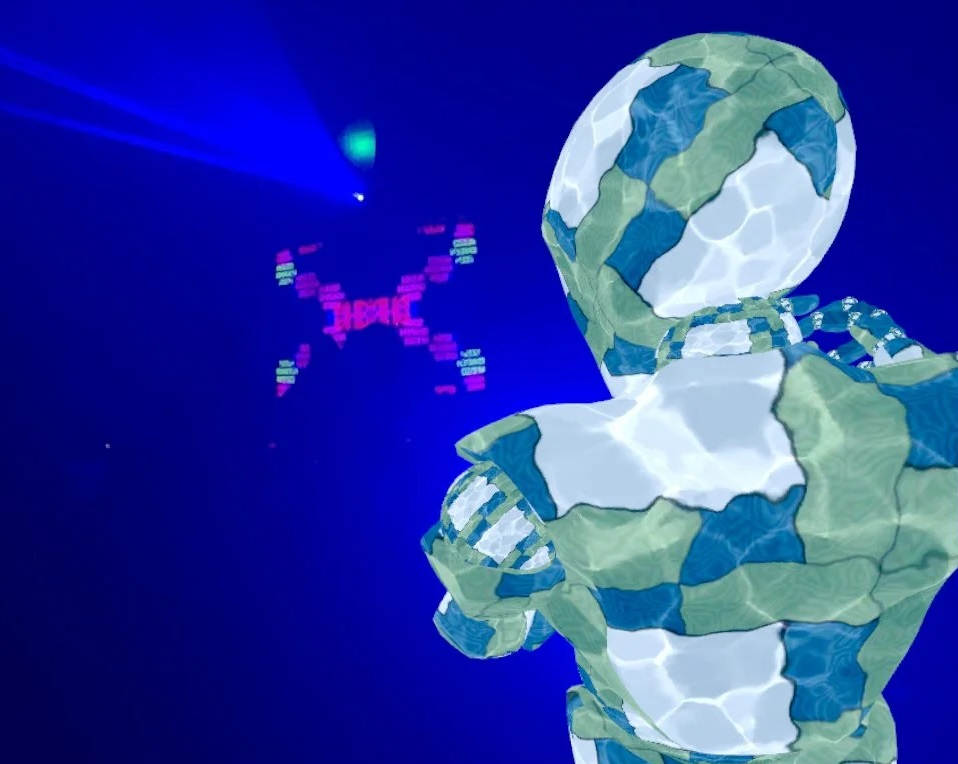

# TU856/TU857/TU858/TU984 Games Engines 1 2024 

[What is Games Engines?](https://bryanduggan.org/2024/09/05/what-is-games-engines/)

[DISCORD](https://discord.gg/s6ZT5CDS)

```
Welcome to the Metaverse
```



## Assessment
- 20% Weekly git commits
- 30% Assignment
- 50% Exam 

## Week 2

### Lab 

Update your fork and main branch from upstream
Create a branch 

Your task is to create a "tower spawner". A Node3D that has a script attached with fields for 
    - radius
    - number of bricks
    - height
    - brick scene

You should be able to place the node in the scene and it should spawn a tower of bricks like the one in this video:

[](http://www.youtube.com/watch?v=zgCDuOoTKU8)

## Week 1
- [Recording 1](https://tudublin-my.sharepoint.com/:v:/g/personal/bryan_duggan_tudublin_ie/EU96Sb2R--pAjhT7ZrP2tsgBfyypHCHUivWlup4KVw4PNA?nav=eyJyZWZlcnJhbEluZm8iOnsicmVmZXJyYWxBcHAiOiJTdHJlYW1XZWJBcHAiLCJyZWZlcnJhbFZpZXciOiJTaGFyZURpYWxvZy1MaW5rIiwicmVmZXJyYWxBcHBQbGF0Zm9ybSI6IldlYiIsInJlZmVycmFsTW9kZSI6InZpZXcifX0%3D&e=Fb8UQf)

### Lab

- Fork the repo
- [Submit your fork](https://forms.office.com/Pages/ResponsePage.aspx?id=yxdjdkjpX06M7Nq8ji_V2ou3qmFXqEdGlmiD1Myl3gNUQUYzR082WFNZQUNTSlpZUkY3VzE5N0xBNi4u)